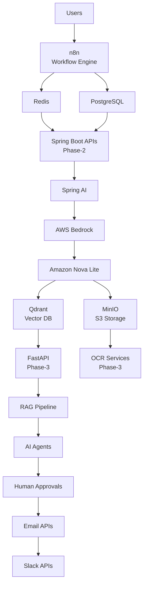

# Agentic AI Enterprise Lab — Architecture

> Exported from the interactive canvas.
>
> Canvas (interactive): open beside chat in Cursor — `agentic-ai-enterprise-lab-architecture.canvas.tsx`

Proposed end-to-end architecture: workflow orchestration, Spring AI backend, Bedrock LLM, vector and object storage, RAG pipeline, agentic automation, and human-in-the-loop notifications.

| Focus | Component |
|-------|-----------|
| Workflow engine | n8n |
| Backend AI layer | Spring AI |
| Foundation model | Amazon Nova Lite |
| Intelligence core | RAG + Agents |

---

## Architecture flow

Top-to-bottom request and data flow across orchestration, persistence, AI inference, knowledge retrieval, and outbound integrations.

**Phase callouts**

- **Phase-2** — Spring Boot APIs: enterprise backend services
- **Phase-3** — FastAPI + OCR: document ingestion and processing

---

## Layer responsibilities

| Layer | Components | Role |
|-------|------------|------|
| Orchestration | n8n | Route user workflows, trigger jobs, coordinate service calls |
| Data & Cache | Redis, PostgreSQL | Session/cache layer and durable relational storage |
| Application (Phase-2) | Spring Boot APIs, Spring AI | REST APIs, AI orchestration, Bedrock model invocation |
| AI Inference | AWS Bedrock, Amazon Nova Lite | Managed LLM inference for agent reasoning and generation |
| Knowledge Store | Qdrant, MinIO | Vector embeddings for RAG and object storage for documents |
| Ingestion (Phase-3) | FastAPI, OCR Services | Document parsing, text extraction, and pipeline entry points |
| Intelligence | RAG Pipeline, AI Agents | Grounded retrieval, multi-step agent execution |
| Governance & Output | Human Approvals, Email APIs, Slack APIs | Approval gates before actions; notify stakeholders via email and Slack |

---

## Component list

| ID | Title | Notes |
|----|-------|-------|
| users | Users | Entry point |
| n8n | n8n | Workflow Engine |
| redis | Redis | Cache / sessions |
| postgres | PostgreSQL | Durable storage |
| spring-boot | Spring Boot APIs | Phase-2 |
| spring-ai | Spring AI | ChatClient / Bedrock bridge |
| bedrock | AWS Bedrock | Managed inference |
| nova | Amazon Nova Lite | Foundation model |
| qdrant | Qdrant | Vector DB |
| minio | MinIO | S3 Storage |
| fastapi | FastAPI | Phase-3 |
| ocr | OCR Services | Phase-3 |
| rag | RAG Pipeline | Retrieval + generation |
| agents | AI Agents | Multi-step automation |
| approvals | Human Approvals | HITL gates |
| email | Email APIs | Notifications |
| slack | Slack APIs | Notifications |
