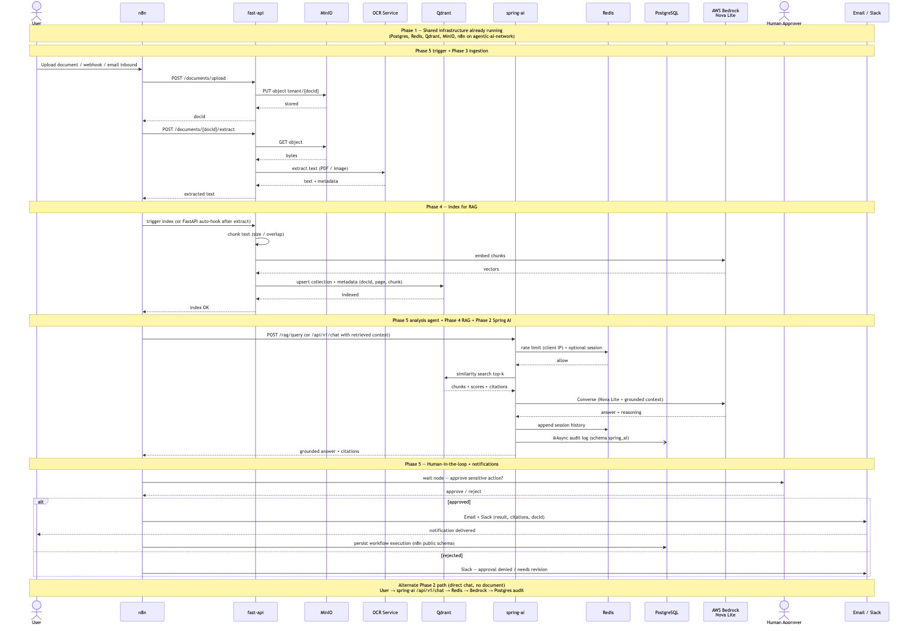
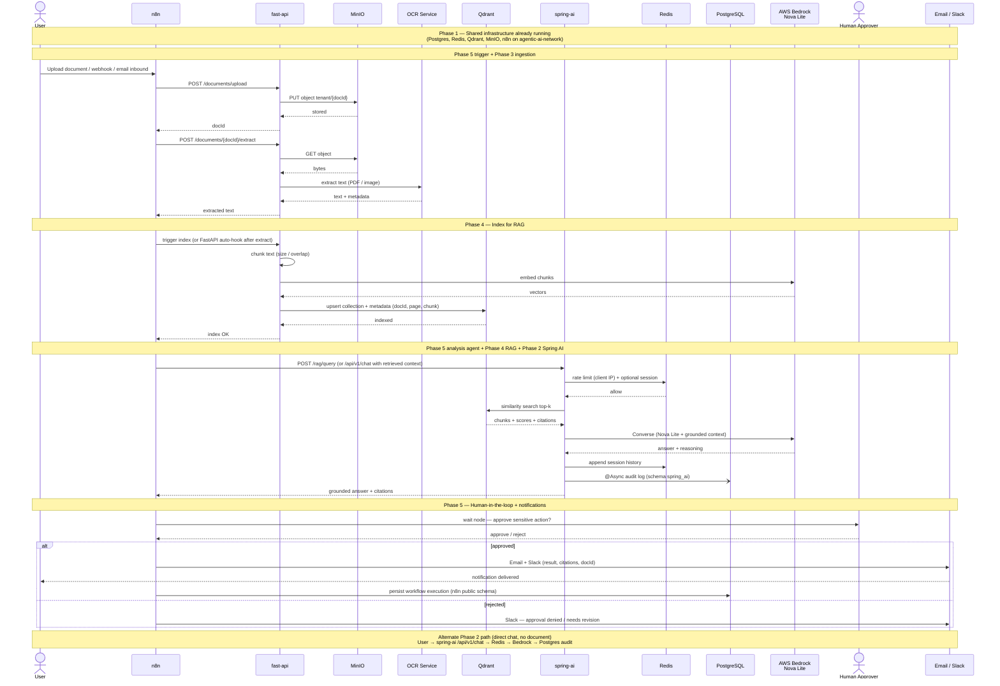

# End-to-End — All Phases Sequence Diagram

> Companion to [`phase-checklist.md`](./phase-checklist.md) and
> [`architecture.md`](./architecture.md). Shows the **target** happy path once
> Phases 1–5 are complete. Phases 1–2 are implemented today; 3–5 are planned
> (shown as the intended orchestration).

One story: a user submits a document through n8n → FastAPI stores and extracts
text → RAG indexes into Qdrant → an agent asks a grounded question via Spring AI /
Bedrock → a human approves → Email/Slack notify. Phase 1 infrastructure is the
shared foundation underneath every hop.

## Visual (PNG)

*Source Mermaid: [`end-to-end-sequence-diagram.mmd`](./end-to-end-sequence-diagram.mmd) · Rendered at 1568×1084*

## Mermaid source

## How phases map onto the flow

| Step in the diagram | Phase | Status |
|---------------------|-------|--------|
| Infra up (Postgres, Redis, Qdrant, MinIO, n8n) | 1 | Done |
| `spring-ai` chat, Redis session/rate limit, Postgres audit, Bedrock | 2 | Done |
| Upload → MinIO → OCR extract | 3 | Planned |
| Chunk → embed → Qdrant → RAG query + citations | 4 | Planned |
| n8n orchestration, approval gate, Email/Slack | 5 | Planned |

## Notes

- **n8n is the Phase 5 conductor** — it does not replace Spring AI or FastAPI; it calls them over `agentic-ai-network` (`http://spring-ai:8080`, `http://fast-api:8000`).
- **Two Postgres “lanes”:** n8n owns workflow tables in schema `public`; Spring AI owns `spring_ai.chat_audit_log` for chat/RAG audit.
- **Redis** is used by Spring AI (Phase 2+) for session cache and rate limiting; n8n may also use it later for queues/rate limits.
- **Qdrant + MinIO** are provisioned in Phase 1 but first consumed in Phases 3–4.
- Phases 3–5 boxes are **target design** from the checklist/architecture — wire them as you implement each phase.

## Related diagrams

| Diagram | Scope |
|---------|--------|
| [`phase-1-sequence-diagram.md`](./phase-1-sequence-diagram.md) | Compose startup / healthchecks |
| [`phase-2-sequence-diagram.md`](./phase-2-sequence-diagram.md) | Chat request path in detail |
| [`architecture.md`](./architecture.md) | Component layer overview |
