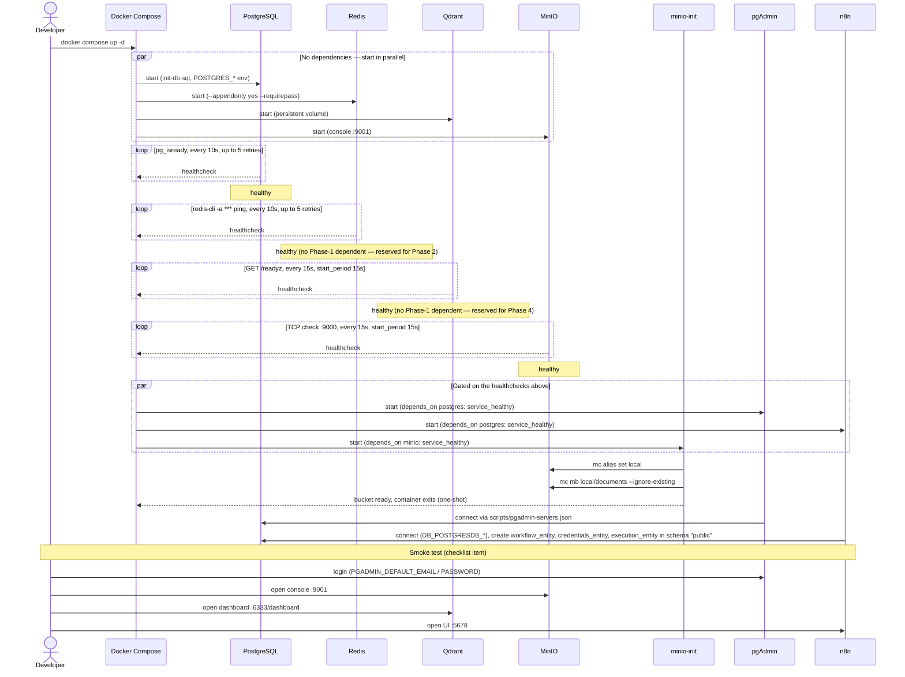

# Phase 1 — Docker Compose Infrastructure: Sequence Diagram

> Companion to [`phase-checklist.md`](./phase-checklist.md). Reflects the actual
> `depends_on`/healthcheck wiring in the root `docker-compose.yml`, not just the
> checklist prose.

Startup order is governed entirely by `depends_on: condition: service_healthy`.
Four services have no dependencies and start in parallel; two dependents
(`pgadmin`, `n8n`) gate on Postgres becoming healthy, and `minio-init` gates on
MinIO becoming healthy. Redis and Qdrant have **no dependents within Phase 1**
— they're provisioned here for Phase 2 (Spring Boot cache/rate-limit) and
Phase 4 (RAG vector search) respectively.

## Visual (PNG)

*Source Mermaid: [`phase-1-sequence-diagram.mmd`](./phase-1-sequence-diagram.mmd) · Rendered at 1568×1182*

## Mermaid source

## Notes

- **`postgres`** is the only service with two direct dependents (`pgadmin`, `n8n`) — it's the critical path for Phase 1 startup time.
- **`minio-init`** is a one-shot init container (`image: minio/mc`), not a long-running service — it runs `mc alias`/`mc mb` once and exits, which is why it isn't part of the steady-state topology.
- **Redis and Qdrant are provisioned, not yet consumed**, in Phase 1 — the compose file's own comments mark them `Phase 2 Spring Boot` and `Phase 4 RAG` respectively. This diagram shows them starting and passing health checks, but nothing in Phase 1 itself talks to them.
- n8n's `DB_POSTGRESDB_SCHEMA` is `public` — the same schema later split from `spring_ai` in Phase 2 (see `scripts/init-db.sql` and `services/spring-ai/README.md`) to isolate audit data from n8n's blanket schema privileges.
