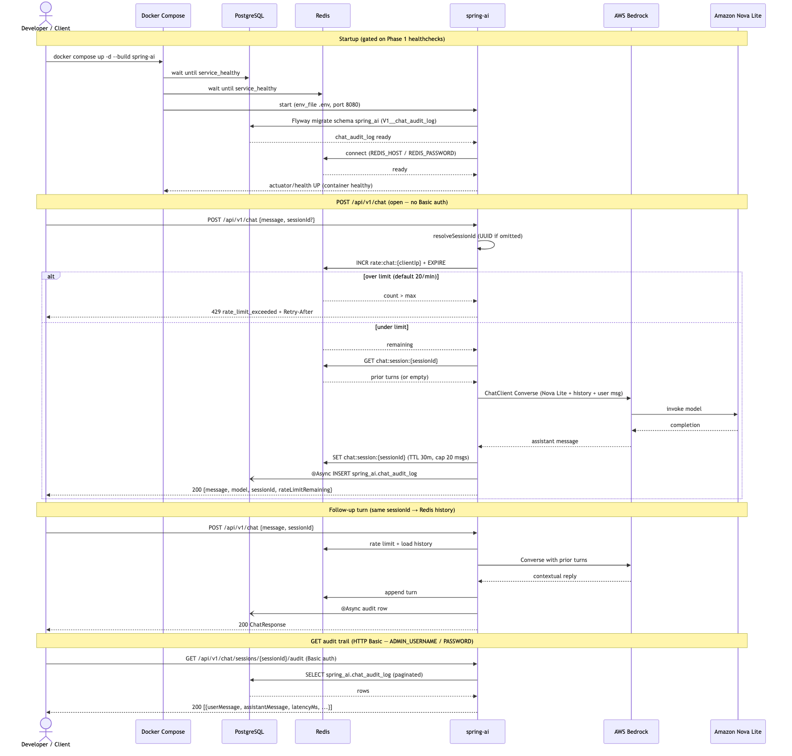
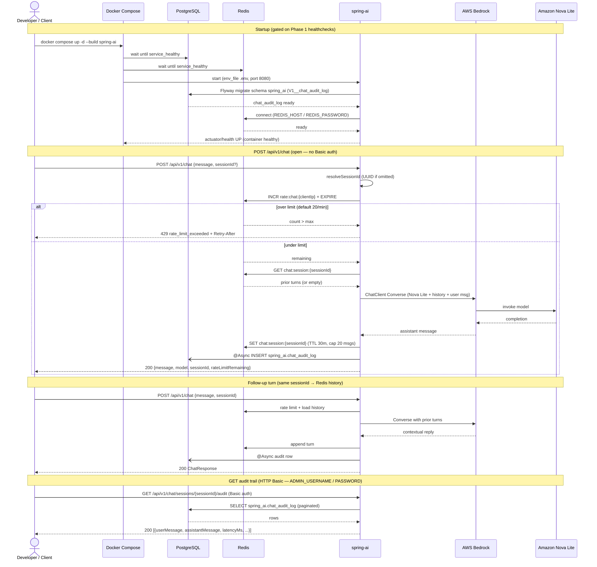

# Phase 2 — Spring Boot + Spring AI + Bedrock: Sequence Diagram

> Companion to [`phase-checklist.md`](./phase-checklist.md) and
> [`services/spring-ai/README.md`](../services/spring-ai/README.md). Reflects the
> actual `depends_on` wiring in `docker-compose.yml` and the request path in
> `ChatController` / Redis / Flyway / Bedrock Converse.

Phase 2 adds the **`spring-ai`** service on top of Phase 1 infra. It waits for
**PostgreSQL** and **Redis** to be healthy, runs Flyway into schema `spring_ai`
(separate from n8n's `public`), then serves chat via Spring AI → AWS Bedrock
(Amazon Nova Lite). Redis holds ephemeral session history + IP rate limits;
Postgres holds durable audit rows (async, fire-and-forget).

## Visual (PNG)

*Source Mermaid: [`phase-2-sequence-diagram.mmd`](./phase-2-sequence-diagram.mmd) · Rendered at 1568×1496*

## Mermaid source

## Notes

- **`spring-ai` depends_on** `postgres: service_healthy` and `redis: service_healthy` only — Qdrant/MinIO/n8n are unused in Phase 2.
- **Redis vs Postgres:** Redis = hot session context + rate counters (TTL). Postgres `spring_ai.chat_audit_log` = durable history (survives Redis TTL; async write must not fail the chat response).
- **Rate limit key is client IP**, not `sessionId` — a caller that omits `sessionId` would otherwise mint a new key every request and bypass the limiter.
- **Audit read is authenticated** because `sessionId` is client-supplied; without Basic auth, anyone who guessed an ID could read another session's transcript.
- **Bedrock** is external (AWS). Credentials come from `.env` (`AWS_ACCESS_KEY_ID`, `AWS_SECRET_ACCESS_KEY`, `BEDROCK_MODEL_ID=amazon.nova-lite-v1:0`).
- Live coverage: `BedrockChatIntegrationTest` (skipped when AWS keys are unset).
